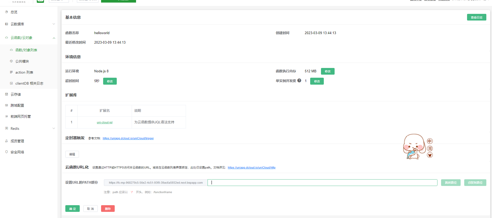

# 云函数云对象

## 新建云函数

右击`cloudfunctions`文件夹，点击`新建云函数/云对象`

例如，新建`func`云函数，该云函数文件夹下的`index.js`中，添加代码如下

```js
'use strict';
const db = uniCloud.database()
exports.main = async (event, context) => {
  return db.collection("article").get()
};
```

## 调用云函数

前端页面调用

```vue
<template>
  <view><button @click="get">请求云函数</button></view>
</template>

<script>
export default {
  methods: {
    get() {
      uniCloud
        .callFunction({
          name: "func1",
        })
        .then(res => {
          console.log(res);
        });
    },
  },
};
</script>
```

## 调用云函数两种写法

```js
// promise方式
uniCloud.callFunction({
    name: 'hellocf',
    data: { a: 1 }
  })
  .then(res => {})

// callback方式
uniCloud.callFunction({
	name: 'hellocf',
	data: { a: 1 },
	success(){},
	fail(){},
	complete(){}
})
```

## 云函数传递参数

云函数

```js
'use strict';
const db = uniCloud.database()
exports.main = async (event, context) => {
  const { limit } = event
  return db.collection("article").limit(limit).get()
};
```

前端调用

```js
uniCloud.callFunction({
    name: 'hellocf',
    data: { limit: 1 }
  })
  .then(res => {})
```

## 新建云对象

示例，新建`obj1`云对象，该云对象文件夹下的`index.obj.js`中，添加代码如下

```js
const db = uniCloud.database()
module.exports = {
  async get() {
    return await db.collection("article").get()
  }
}
```

## 调用云对象

```js
<template>
  <view>
    <button @click="getObj">请求云对象</button>
  </view>
</template>

<script>
export default {
  methods: {
    getObj() {
      const obj1 = uniCloud.importObject("obj1");
      obj1.get().then(res => {
        console.log(res);
      });
    },
  },
};
</script>
```

## 云对象传递参数

云对象

```js
const db = uniCloud.database()
module.exports = {
  async get(limit) {
    return await db.collection("article").limit(limit).get()
  }
}
```

前端调用

```js
<template>
  <view><button @click="getObj">请求云对象</button></view>
</template>

<script>
export default {
  methods: {
    getObj() {
      const obj1 = uniCloud.importObject("obj1");
      obj1.get(1).then(res => {
        console.log(res);
      });
    },
  },
};
</script>
```

## 上传云函数/云对象至云端

1. 上传单个云函数/云对象：右击该云函数/云对象文件夹，选择`上传部署`
2. 上传所有云函数/云对象：右击`cloudfunctions`文件夹，选择`上传所有云函数、公共模块及actions`
3. 请求报错：`云函数在云端不存在，请检查此云函数名称是否正确以及该云函数是否已上传到服务空间`，检查第一步或第二步是否成功，在HBuilderX里终端勾选`连接云端云函数`，重新编译运行

## 云函数/云对象URL化

> https://uniapp.dcloud.net.cn/uniCloud/http.html#%E4%BD%BF%E7%94%A8%E5%9C%BA%E6%99%AF

1. 登录[uniCloud后台](https://unicloud.dcloud.net.cn/)，选择服务空间
2. 左侧菜单栏选择【云函数/云对象】【函数/对象列表】
3. 点击需要配置的函数/云对象的【详情】按钮，配置访问路径



### 注意

如果配置某云函数路径为`/test`，实际访问`/test`、`/test/a`、`/test/b`都会执行此云函数，在云函数内可以使用`event.path`区分访问来源

阿里云使用默认域名时，在浏览器访问url化地址会触发下载。绑定自定义域名则无此问题

### 云函数请求

URL化，每次修改云函数/云对象代码都需要上传才能更新，并且HBuilderX后控制台不会出现打印信息，这样想调试的话，只能通过返回值的方式，在浏览器查看返回信息

```js
'use strict';
const db = uniCloud.database();
exports.main = async (event, context) => {
  // return db.collection('article').get();
  return { event, context };
};
```

event数据结构如下：

其中get请求传参是queryStringParameters字段，post请求传参是body字段

```js
{
    path: 'HTTP请求路径，如 /hello',
    httpMethod: 'HTTP请求方法，如 GET',
    headers: {HTTP请求头},
    queryStringParameters: {HTTP请求的Query，键值对形式},
    body: 'HTTP请求体',
    isBase64Encoded: 'true or false，表示body是否为Base64编码'
}
```

### 示例

使用GET请求`https://${云函数Url化域名}/${functionPath}?a=1&b=2`，云函数接收到的`event`为

```js
{
    path: '/',
    httpMethod: 'GET',
    headers: {HTTP请求头},
    queryStringParameters: {a: "1", b: "2"},
    isBase64Encoded: false
}
```

使用get请求

```js
uni.request({
  method: 'POST',
  url: 'https://${云函数Url化域名}/${functionPath}',
  data: {
    a: 1,
    b: 2
  },
  success(res) {
    console.log(res);
  }
})

// 云函数收到的event为, 注意如果直接return此格式数据可能会被作为集成响应处理，参考下面的集成响应文档
{
    path: '/',
    httpMethod: 'POST',
    headers: {
    	...
    	"content-type": 'application/json'
    },
    isBase64Encoded: false,
    body: '{"a":1,"b":2}', // 注意此处可能是base64，需要根据isBase64Encoded判断
```

